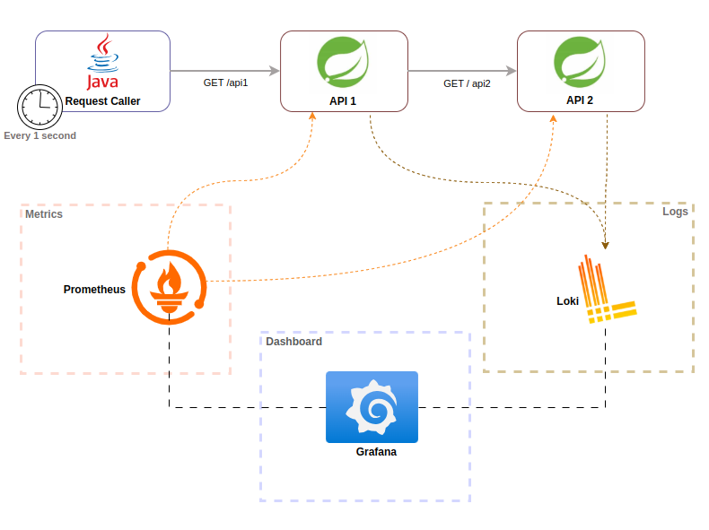

# LOGS AND METRICS IN JAVA SPRING BOOT

## About this project
This project aims to show how to monitor metrics and logs between REST applications.

## Archtecture

Here's a diagram representing the hierarchy and dependencies among the projects in this repository:



## docker enviroment
Loki, prometheus and grafana configurtion are placed in ./docker/ folfer.

### Start containers
Run all container
```bash
# go to docker folder
cd ./docker
# run all containder services
docker compose up -d
```

### Configure prometheus in grafana

 - Access grafana: 
   - Open your browser and go to http://localhost:3000 
   - log with default user `admin` and password `admin` 
 - Add Prometheus as a Data Source in Grafana: 
   - Go to Connections > Data Sources > Add data source.
   - Select Prometheus and set the URL to http://prometheus:9090.
   - Save it.
 - Select a prometheus dashboard
   - Go to dashboard
   - New dashboard
   - Import dashboard
   - add dashboard template url http://grafana.com/grafana/dashboards/4701

### Configure loki in grafana

 - Access grafana: 
   - Open your browser and go to http://localhost:3000 
   - log with default user `admin` and password `admin` 
 - Add Loki as a Data Source in Grafana: 
   - Go to Connections > Data Sources > Add data source.
   - Select Loki and set the URL to http://loki:3100.
   - Save it.

